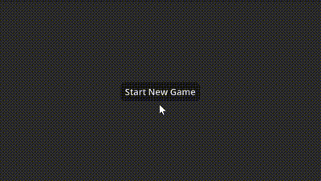

# Vertex

A minimalistic five in a row turn-based strategy game for two players.

Created with [Godot game engine](https://godotengine.org/) with [Chickensoft](https://chickensoft.games/) tools, libraries and [proposed architecture](https://chickensoft.games/blog/game-architecture).

Made in order to explore and learn game development with Godot and C# through a smaller project.

[Game design document](GAME_DESIGN_DOCUMENT.md)

Explores:

* Game architecture
* Scripted movable camera when game board size increases
* Animations
* Calculate winning state
* Working with very simple 3D models from Blender
* Menu theming
* Audio effects
